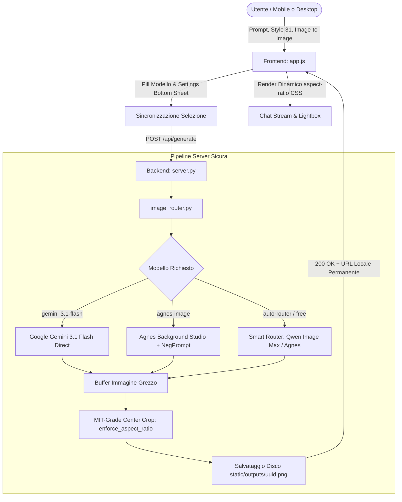

# Architettura di Sistema — AGOS Pict Studio

> **Versione:** 2.4.0 — Production-Ready Creative Sandbox & Mobile-First Engine  
> **Data Ultimo Aggiornamento:** 05 Settembre 2026  
> **Ecosistema:** AGOS Visual Lab · Ponte strategico verso PosterLab Pro

---

## 1. Visione del Progetto e Posizionamento

**AGOS Pict Studio** è il playground creativo e generativo dell'ecosistema AGOS. Fornisce a designer, content creator e professionisti visuali un ambiente ad alte prestazioni per testare prompt complessi, sperimentare 31 stili visivi curati e generare bozze grafiche con aspect ratio geometricamente calibrati.

### Ruolo nell'Ecosistema:
* **AGOS Pict Studio (Questo Progetto):** Sandbox rapido, gratuito e reattivo per ideazione, moodboard e sfondi grafici.
* **PosterLab Pro (`40_POSTERLAB`):** Suite commerciale avanzata con canvas vettoriale Fabric.js, tipografia ad alta risoluzione, livelli, esportazione stampa 4K e AI inpainting.

```
┌─────────────────────────────────────────────────────────────┐
│                      AGOS ECOSYSTEM                         │
│                                                             │
│   ┌───────────────────────────┐   Concept & Canvas Export   │
│   │     AGOS PICT STUDIO      │ ─────────────────────────►  │
│   │ (Sandbox, Stili, Sfondi)  │                             │
│   └───────────────────────────┘                             │
│                                   ┌─────────────────────┐   │
│                                   │    POSTERLAB PRO    │   │
│                                   │ (Canvas Vettoriale, │   │
│                                   │  Tipografia, 4K)    │   │
│                                   └─────────────────────┘   │
└─────────────────────────────────────────────────────────────┘
```

---

## 2. Struttura del Repository

```
IMAGE_APP/
├── static/                              # Single Page Application Frontend
│   ├── index.html                       # Layout semantico, toolbar a riga singola e bottom sheets
│   ├── style.css                        # Design system scuro, Neumorphism 2.0, Apple/Android responsive
│   ├── app.js                           # State engine, bottom sheet controller, sincronizzazione form
│   ├── styles.json                      # Database 31 stili curati con palette RGB e prompt direzionali
│   ├── style_previews/                  # Immagini specimen reali dei 31 stili visivi
│   └── outputs/                         # Storage locale su disco dei file generati (URL permanenti)
├── image_router.py                      # Router AI multi-provider, fallback free, Pillow crop MIT-grade
├── server.py                            # Server HTTP multithread (zero dipendenze esterne pesanti)
├── test_ratios.py                       # Test suite automatizzata 8/8 aspect ratio (errore < 0.05%)
├── architettura.md                      # Specifiche architetturali correnti ed evolutive
├── status.md                            # Stato operativo, milestone completate e roadmap sprint
├── .env                                 # Chiavi private lato server (Gemini, LLMAPI)
├── open_browser.py                      # Launcher browser automatico pre-flight
├── start.bat                            # Quick-launcher ultra-rapido
└── start_project.bat                    # Script one-click per avvio rapido ambiente Windows
```

---

## 3. Flusso Dati e Pipeline di Generazione



---

## 4. Architettura dei Modelli AI

Il router (`image_router.py`) gestisce una gerarchia modulare con separazione netta tra modelli e costi:

| Modello | ID Interno | Costo | Specializzazione | Direttive Specifiche |
|---|---|---|---|---|
| **Google Gemini 3.1 Flash Pro** | `gemini-2.5-flash` / `gemini-3.1-flash-image-preview` | 50 Crediti | Fotorealismo Ultra-HD, character consistency e resa perfetta dei testi | Connessione diretta upstream, zero fallback degradanti |
| **Agnes Background Studio** | `agnes-image-2.5-flash` | **0 Crediti (Free)** | Sfondi grafici astratti, texture materiche per poster canvas | Iniezione automatica negative prompt: *no text, no letters, no human faces* |
| **Smart Router Multi-Provider** | `auto-router` | **0 Crediti (Free)** | Bilanciamento automatico tra provider gratuiti ad alta disponibilità | Routing prioritario Qwen Image Max con fallback su Agnes Studio |
| **Qwen Image Max** | `qwen-image-max-2025-12-30` | **0 Crediti (Free)** | Dettagli grafici, composizioni complesse e illustrazioni | Upstream LLMAPI Image Generations |

> 🔒 **Sicurezza Chiavi:** Le API Key (`GEMINI_API_KEY`, `LLMAPI_API_KEY`) non vengono **mai** inviate al client. Risiedono unicamente nel file `.env` sul server.

---

## 5. Aspect Ratio Engine ("MIT-Grade")

Per garantire l'assenza di distorsioni visive e un controllo geometrico rigoroso sui layout editoriali e social, il sistema implementa un doppio livello di calibrazione:

1. **Ritaglio Fisico su Disco (`enforce_aspect_ratio` via Pillow):**
   - L'immagine restituita dal fornitore AI viene analizzata nelle sue dimensioni reali in pixel.
   - Se il rapporto d'aspetto differisce dal target oltre una tolleranza analitica dell'1.5%, Pillow esegue un center-crop simmetrico preservando la massima area utile.
   - **Risultato Validato:** Errore geometrico medio inferiore allo **0.03%** su tutti gli 8 aspect ratio supportati (`1:1`, `9:16`, `4:5`, `16:9`, `3:4`, `2:3`, `3:2`, `21:9`).
2. **Zero Cumulative Layout Shift (CLS = 0):**
   - Il contenitore frontend `.img-wrap` applica `aspect-ratio: ratio.replace(':', '/')`.
   - Lo spazio a schermo viene riservato prima del caricamento del bitmap, eliminando ogni sfarfallio della pagina.

---

## 6. Architettura UI/UX Studio (Ispirazione Leonardo.AI)

L'interfaccia adotta un'architettura **Studio / Creative Canvas** d'ispirazione Leonardo.AI e Midjourney Studio, superando la metafora della chat sequenziale per focalizzarsi sulla creazione visiva:

* **Header Superiore Studio:**
  - Branding AGOS Pict con tag modalità `AI CREATION`.
  - Indicatore di sessione e pillola crediti utente con stato e tasto rapido `+ Ricarica`.
  - Accesso diretto con pulsante dedicato in testata `[ 🎨 Stili (31) ]`.
* **Sidebar Sinistra — Controlli Studio:**
  - **Selettore Modello AI:** Menu elegante a tendina con badge di costo in tempo reale (`Free` o `50 crediti`).
  - **Formato & Risoluzione (Ratio Tiles Grid):** 8 tessere grafiche proporzionali (`1:1`, `9:16`, `4:5`, `16:9`, `2:3`, `3:4`, `3:2`, `21:9`) con indicazione analitica dei pixel target (`1024×1024 px`, `720×1280 px`, ecc.) sincronizzati con il motore Pillow.
  - **Qualità di Rendering:** Segmented control rapido a tre stati (`Auto`, `Ultra-HD`, `Bozza`).
  - **Reset to Defaults:** Pulsante per il ripristino istantaneo delle impostazioni predefinite.
  - **Stato del Router e Sessioni Recenti:** Gestione cronologia e monitoraggio connettività.
* **Barra Prompt in Alto ad Auto-Espansione:**
  - Posizionata in cima all'area di creazione con `position: sticky` e sfocatura gradiente.
  - Textarea con auto-resize dinamico che cresce fluidamente all'aumentare della lunghezza del prompt inserito (da 38px a 180px con scrolling morbido).
  - Chip integrati per immagine di riferimento (Image-to-Image) e stile visivo attivo con rimozione `✕`.
  - Pulsante `[ 🎨 Stili 31 ]` incorporato nella barra per accesso rapido ai 31 stili curati.
  - Pulsante principale `✦ Genera` con gradiente terracotta/ambra e stato disabilitato intelligente.
  - Banner di stato piano gratuito in verde smeraldo con indicatore crediti inclusi.
* **Box Canva Espositivo in Basso (Featured Canvas Card):**
  - Spazio centrale dedicato all'immagine generata in pieno formato a zero Cumulative Layout Shift (CLS = 0).
  - Colonna sinistra: Immagine con center-crop analitico, zoom lightbox su click e overlay hover con download rapido.
  - Colonna destra: Scheda metadati completa con prompt di generazione (pulsante di copia istantanea negli appunti), badge modello, risoluzione in pixel, ratio geometrico e indicatore di stile.
  - Azioni primarie: Download ad altissima risoluzione, esportazione verso PosterLab Pro e pulsante `🔄 Variazione Prompt`.
  - Card di caricamento con spinner e pulsazione geometrica durante l'inferenza AI.
* **Cassetto Destro Stili (31):**
  - Maniglia sul bordo destro `"🎨 STILI ▶"` perfettamente integrata con i colori di progetto.
  - 31 stili visuali curati con anteprime reali da PosterLab, barra di ricerca istantanea e filtri per categorie.
* **Responsive Mobile Ergonomics:**
  - Viewport adattivo `100dvh` con safe area insets per iPhone e Android.
  - Sidebar a scomparsa con drawer mobile e font input a 16px anti-zoom Safari.
* **Purple Ban Rigoroso:** Totale assenza di tonalità viola/magenta. Palette costruita su ardesia scura (`#0c0e14`), terracotta (`#e05638`), ocra dorata (`#e5a823`), ciano ultramarine (`#00b4d8`) e verde smeraldo (`#00e599`) per crediti e piani free.

---

## 7. Roadmap & Specifiche Tecniche per i Prossimi Sprint

Domani l'applicazione scalera verso una piattaforma multi-utente con persistenza cloud e monetizzazione:

```
┌────────────────────────────────────────────────────────────────────────┐
│                   SUPABASE AUTH & DATABASE LAYER                       │
│                                                                        │
│   Google OAuth ──► Supabase Auth ──► JWT Session (localStorage)        │
│                                      │                                 │
│                                      ▼                                 │
│                     ┌──────────────────────────────────┐               │
│                     │  PostgreSQL Tables (RLS Active)  │               │
│                     │  - profiles (credits, avatar)    │               │
│                     │  - showcase_posts (vetrina)      │               │
│                     │  - credit_transactions          │               │
│                     └──────────────────────────────────┘               │
└────────────────────────────────────────────────────────────────────────┘
                                      ▲
                                      │ Webhook (checkout.session.completed)
┌─────────────────────────────────────┴──────────────────────────────────┐
│                          STRIPE PAYMENT GATEWAY                        │
│                                                                        │
│   Frontend (Stripe Checkout) ──► Server (Create Session) ──► Stripe    │
└────────────────────────────────────────────────────────────────────────┘
```

### 7.1 Integrazione Supabase (Auth Google, Profili & Vetrina)
1. **Google OAuth & User Session:**
   - Integrazione `@supabase/supabase-js` (via CDN o bundle pulito).
   - Login one-click con Google: `supabase.auth.signInWithOAuth({ provider: 'google' })`.
   - Header dinamico: Sostituzione del pulsante login con Avatar utente, nome e saldo crediti sincronizzato.
2. **Schema Tabelle PostgreSQL (con Row-Level Security - RLS):**
   - **`profiles`:**
     - `id` (UUID, references `auth.users.id`, PRIMARY KEY)
     - `email` (TEXT)
     - `username` (TEXT, UNIQUE)
     - `avatar_url` (TEXT)
     - `bio` (TEXT)
     - `credits_balance` (INTEGER, default: 150)
     - `created_at` (TIMESTAMPTZ)
   - **`showcase_posts` (Vetrina Creativa Pubblica):**
     - `id` (UUID, PRIMARY KEY)
     - `user_id` (UUID, references `profiles.id`)
     - `image_url` (TEXT)
     - `prompt` (TEXT)
     - `style_id` (TEXT)
     - `aspect_ratio` (VARCHAR(10))
     - `is_public` (BOOLEAN, default: true)
     - `likes_count` (INTEGER, default: 0)
     - `created_at` (TIMESTAMPTZ)
   - **`showcase_likes`:** Tabella relazionale per i like della community.
3. **Sezione Vetrina nel Frontend:**
   - Nuova vista/tab "Vetrina della Community" con visualizzazione a griglia asimmetrica delle migliori creazioni.
   - Pulsante "Pubblica in Vetrina" su ogni concept generato in chat.

### 7.2 Integrazione Stripe (Acquisto & Ricarica Crediti)
1. **Pacchetti Crediti Previsti:**
   - **Starter Pack:** 500 Crediti (~€4.99) — Ideale per bozze veloci e 10 generazioni Gemini Pro.
   - **Creator Pack:** 1500 Crediti (~€12.99) — Per campagne visive e sperimentazione intensiva.
   - **Studio Pro:** 5000 Crediti (~€34.99) — Pieno accesso ad alta definizione e priorità router.
2. **Architettura di Pagamento Sicura:**
   - **Frontend:** Cliccando su "Ricarica Crediti", l'utente seleziona il pack e invia una richiesta `POST /api/stripe/create-checkout-session`.
   - **Backend:** `server.py` interagisce con le API Stripe (`stripe.checkout.Session.create`) passando il `user_id` nei metadati protetti.
   - **Webhook di Verifica (`POST /api/stripe/webhook`):**
     - Il server riceve l'evento `checkout.session.completed`.
     - Verifica crittografica della firma con `STRIPE_WEBHOOK_SECRET`.
     - Incremento transazionale dei crediti nella tabella `profiles` su Supabase tramite service role key.
